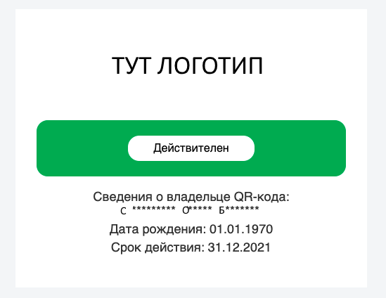

# генератор веселых QR кодов для милого собянина (censored version) ###

## disclaimer ##
(censored)

## использование ##
```
clone repo
cd repo
uvicorn qr:app --host=127.0.0.1 --port 8000 --proxy-headers
```

далее вручную крафтим ссылку вида  
>http[s]://sitename/qr/{параметры вашего qr-кода}

строка параметров имеет строгий формат: **ФdИdОdDDMMYYYYddmmyyyy**  
где буквы **Ф,И,О** - первая буква фамилии, имени, отчества  

**d** после каждой буквы - количество звездочек в маске которые скрывают остальные буквы имени (т.е. длина имени-1)  
например Саритонова Ольяна Борковна => С9О5Б7 отобразится как:  
>С********* О***** Б*******

**d** - строго одинчный символ, но для случая когда отчество превышает по длине 10 букв  
используется шеснадцатиричная база, т.е. **d** может принимать значения от **0** до **15**  
при этом для чисел от **10** до **15** используются буквы английского алфавита: **a b c d e f**

дальше *DDMMYYYY* - дата рождения  
а *ddmmyyyy* - срок действия

Для нашей Ольяны родившейся в день рожения UNIX-а строка параметров получит следующий вид: **С9О5Б70101197031122021**

И значит итоговая ссылка примет следующий вид:  
https://sitename/qr/С9О5Б70101197031122021  
Вбиваем ссылку в браузер и получаем нужный нам результат 



Осталось сгенерировать QR-код из полученной ссылки  
Для этого достаточно прямо в браузере отредактировать ссылку 

просто заменив в ней фрагмент **/qr/** на **/create/**

т.е была ссылка *https://sitename/qr/С9О5Б70101197031122021*  
стала *https://sitename/create/С9О5Б70101197031122021*


# nginx
Естественно толку от QR-кода никакого если закодированная им ссылка будет вести на локалхост. Поэтому сайт конечно стоит спрятать за nginx

Рабочий конфиг для nginx с SSL от LetsEncrypt */etc/nginx.sites-enabled/qr.conf*
```
server {
    server_name YOURSERVERNAME;

    location / {
        proxy_pass http://127.0.0.1:8000;    
            proxy_set_header Host $http_host;
        proxy_set_header X-Forwarded-For $proxy_add_x_forwarded_for;
        proxy_set_header X-Forwarded-Proto $scheme;
        proxy_redirect off;
        proxy_buffering off;
    }

    listen 443 ssl; # managed by Certbot
        ssl_certificate /etc/letsencrypt/live/your.server.name/fullchain.pem; # managed by Certbot
        ssl_certificate_key /etc/letsencrypt/your.server.name/privkey.pem; # managed by Certbot
        include /etc/letsencrypt/options-ssl-nginx.conf; # managed by Certbot
        ssl_dhparam /etc/letsencrypt/ssl-dhparams.pem; # managed by Certbot

}   

server {
    if ($host = blablabla) {
        return 301 https://$host$request_uri;
    } # managed by Certbot

    server_name YOURSERVERNAME;

    listen 80;
    return 404; # managed by Certbot
}
```

